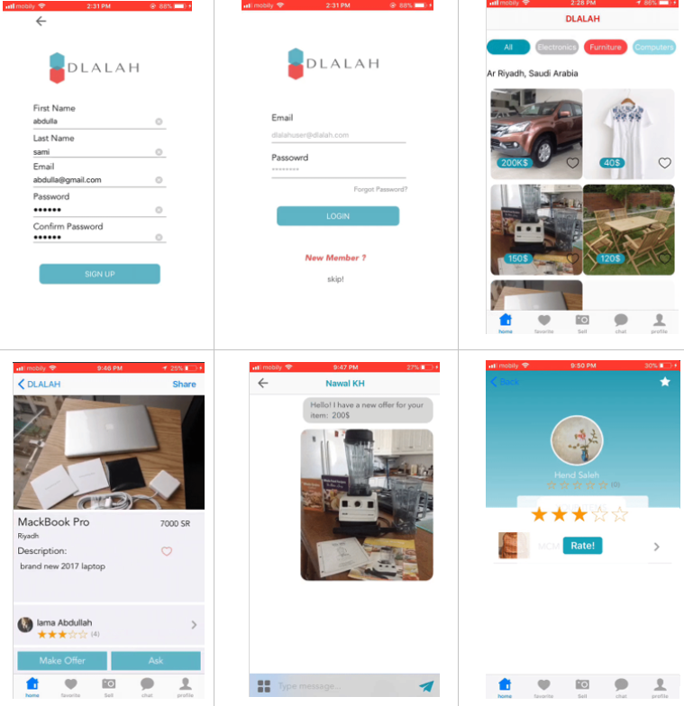

# Dlalah-app

DLALAH is a mobile IOS application that holds online auctions of various items, and serves as a place for buyers and sellers to come together and trade almost anything. 

## Application Main Features:
1. Users can create an account, log in and out. 
2. Users can browse the app to search for great deals of items, either by searching a specific category or by looking for items nearby their location. 
3. Users can also offer their used goods for sale
4. Users can bid to buy a specific item
5. Users can add items to their favorite list
6. Users can share an item through social media platforms 
7. Users can rate sellers
8. Users can message other users within the app. 

### Some screenshots

